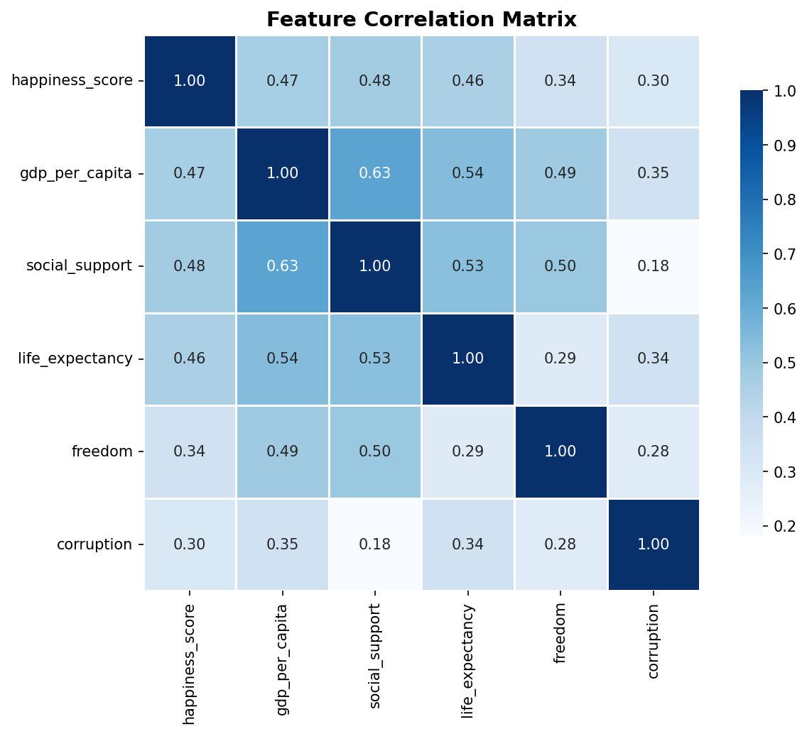
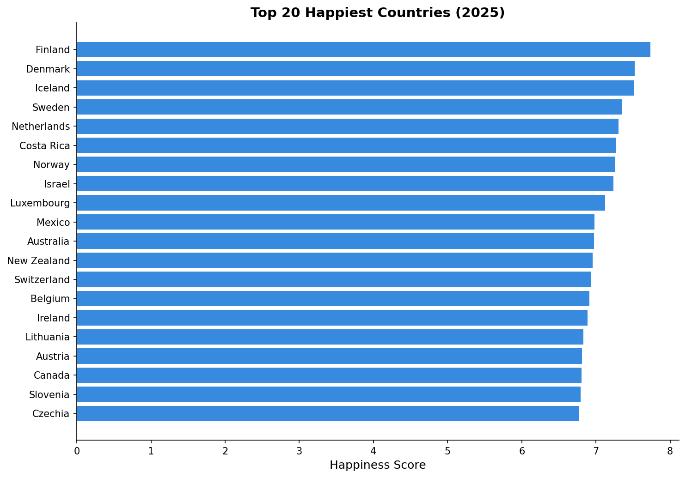
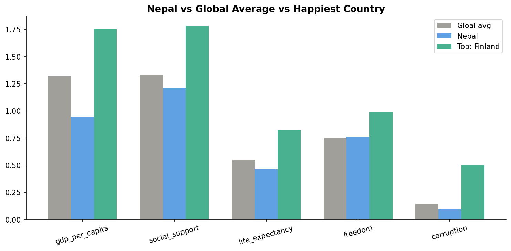

# World Happiness Report — Exploratory Data Analysis

## Overview
Analysis of the UN World Happiness Report dataset (147 countries, 2025)
to identify the key drivers of national happiness scores.

## Key Findings
- Social support is the strongest predictor (r = 0.812)
- Nepal ranks #99 — weakest factor: GDP per capita
- Western Europe leads; Sub-Saharan Africa trails
- Social support dominates the freedom

## Charts




## Tech Stack
Python · pandas · NumPy · matplotlib · seaborn · Jupyter

## How to Run
```bash
# Clone the repository
git clone https://github.com/awecodes24/happiness-eda

# Navigate into the project directory
cd happiness-eda

# Install required dependencies
pip install -r requirements.txt

# Launch Jupyter Notebook
jupyter notebook notebooks/analysis.ipynb